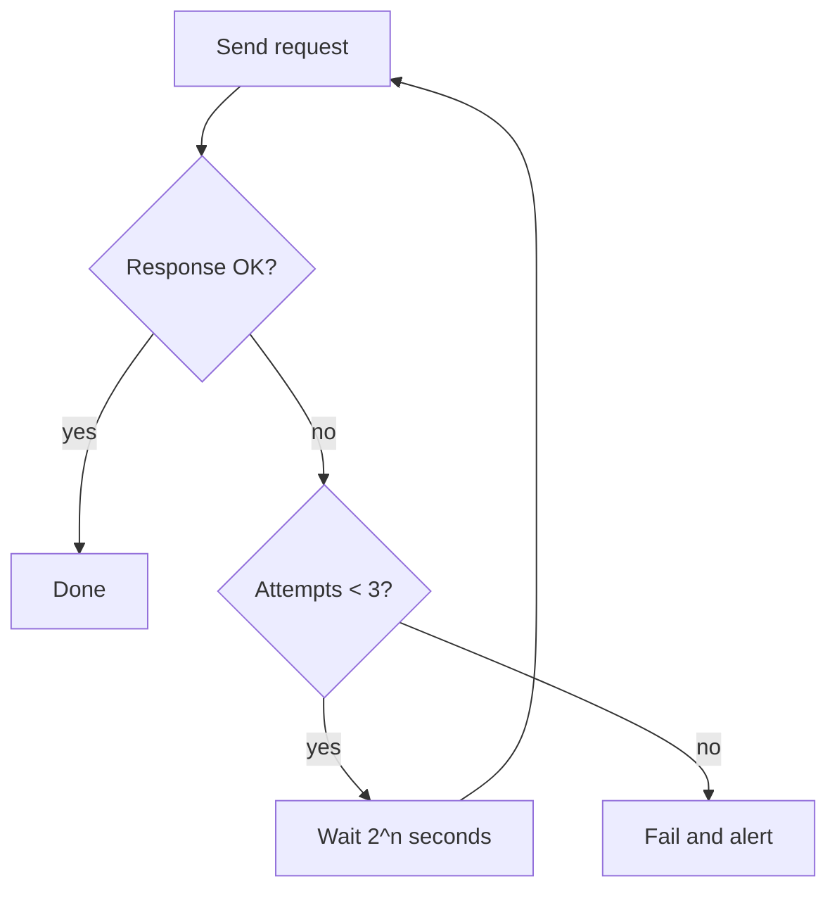

# Figures reference

A figure is worth including when it shows something a sentence would state badly: a shape, a relationship, a flow with branches, a comparison across many values. It is not worth including when it restates a table, decorates a section, or shows data the source does not contain.

## Contents

1. Deciding whether to draw
2. Mermaid diagrams
3. Rendered plots with matplotlib
4. Captions
5. Placement and references

## 1. Deciding whether to draw

Ask three questions. Draw only if all three are yes.

1. **Is there a real shape?** Flow with branches, a hierarchy, a trend, a distribution, a before/after comparison of numbers. A list of three items has no shape. A sequence of seven steps with two branches does.
2. **Is the data real?** Numbers must come from the source. Structure must be what the source describes. Never invent a curve to illustrate a point. If the source says "latency grows with queue depth" but gives no numbers, do not plot it. Say it in words, or draw a Mermaid diagram of the mechanism instead.
3. **Will it render where the reader is?** Mermaid renders in GitHub, GitLab, VS Code preview, Obsidian, and most markdown tools. PNG renders anywhere the file link resolves. Nothing renders in the terminal, so in last-response mode a Mermaid block is a code block the reader must paste somewhere. In last-response mode, prefer a table or a short progression, and only use Mermaid when the structure really needs it.

When the output already carries the numbers in a table, the figure must show something the table cannot: a shape across many values, an overlay of several series, a knee. A table of roughly six rows or fewer shows its own shape; keep the table and skip the figure. Do not keep both for the same data.

A typical document has zero to three figures. If you are reaching for a fourth, check whether two of them could be one.

## 2. Mermaid diagrams

Use Mermaid for structure: components, data flow, state machines, sequences, dependency order.

| Source describes | Mermaid type |
|---|---|
| Steps with branches or loops | `flowchart TD` (top-down) or `LR` (left-right) |
| Messages between parties over time | `sequenceDiagram` |
| Modes and transitions | `stateDiagram-v2` |
| Which components talk to which | `flowchart` with subgraphs |
| Schema or entity relationships | `erDiagram` |

Rules that keep diagrams readable:

- Under about 12 nodes. Split larger diagrams by concern.
- Node labels are short noun phrases. Edge labels are short verbs or conditions.
- One direction. Do not mix top-down and left-right in one diagram.
- Quote labels that contain punctuation: `A["Retry (max 3)"]`.
- Name the diagram in the caption, not inside it.

Example, for a retry policy:

Caption: *Figure 1: A failed request retries at most three times, with doubling waits, before alerting.*

## 3. Rendered plots with matplotlib

Use a rendered plot for quantities: a trend over a variable, a comparison of measured values, a distribution.

Workflow:

1. Copy `scripts/plot.py` to the scratchpad directory. It carries its own dependency header, so `uv run plot.py` works without a project or virtualenv.
2. Put the numbers from the source into the `DATA` block. Do not smooth, extrapolate, or add points.
3. Pick the chart shape: line for a trend, grouped bars for a comparison of a few values, histogram for a distribution. The script has one function per shape.
4. Set the output path to `assets/<doc-name>/<short-name>.png`, relative to the output document. Create the folder.
5. Run it: `uv run plot.py`. Open the PNG with the Read tool and check it: axes labeled with units, the takeaway visible, nothing clipped.
6. Link it: ``, followed by the caption line.

Keep the script in the scratchpad unless the user asks to keep it. The PNG is the deliverable.

Plot style, already set in the script: one chart per figure, no title inside the image (the caption carries it), axis labels with units, direct labels on lines instead of a legend when there are three or fewer series, muted palette, 200 dpi.

If `uv` is missing, say so and fall back to a table. Do not install tools without asking.

## 4. Captions

The caption states the takeaway. The reader should be able to read only the captions and learn the document's main claims.

| Label (do not write) | Caption (write) |
|---|---|
| Figure 1: System architecture | Figure 1: All writes pass through the coordinator, so it is the single point of failure. |
| Figure 2: Latency vs load | Figure 2: p99 latency is flat until 400 rps, then doubles every 100 rps. |
| Figure 3: Retry flow | Figure 3: A request retries at most three times before alerting. |

Format: italic line directly under the figure. Number figures in order. Mark the data's status in the caption when it matters: "(measured, staging)" or "(expected, not yet tested)".

## 5. Placement and references

Put the figure where the text first needs it, usually in the intuition layer of a mechanism or next to the core-idea table. Reference it in the text by number: "Figure 2 shows the knee at 400 rps." A figure nobody points to is decoration.
